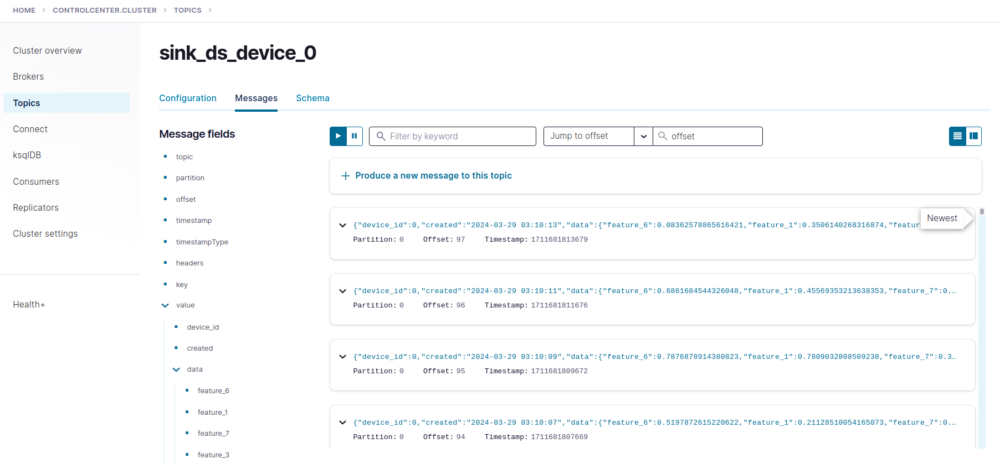
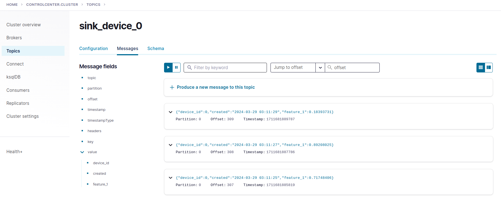
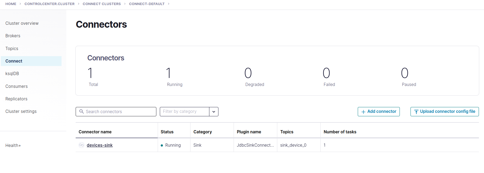
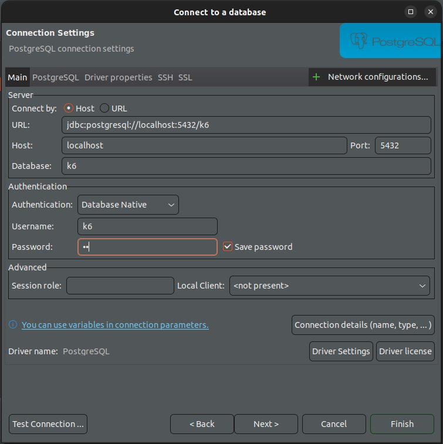
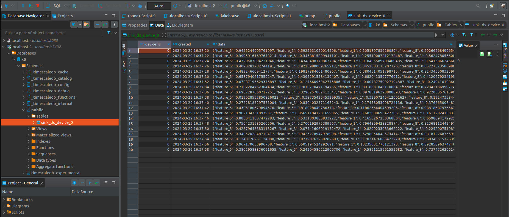

This tutorial aims at running stream processing with Flink

# How-to guide
Please start the docker compose first using command

```shell
docker compose -f docker-compose.yaml up -d
```

## Produce data to Kafka

then, you can check if Kafka producer is running normally by using

```shell
docker logs flink-kafka-producer
```

You can also run the producer manually without using docker compose by using the following command:
```shell
cd data_ingestion/kafka_producer
python produce_json.py
```

If you want to produce data in `avro` format, use the following command instead:
```shell
python produce_avro.py -s http://localhost:8081
```

## PyFlink guide
### Setup environment
- Activate you conda environment and install required packages: 
    ```shell
    conda create -n flink python=3.8
    conda activate flink
    pip install -r requirements.txt
    ```
- Install Java JDK 11 following the section `Using apt
` in this [tutorial](https://docs.aws.amazon.com/corretto/latest/corretto-11-ug/generic-linux-install.html).

### Quickstart
Try some basic operations on a stream by the following command command
```shell
python scripts/operators.py
```
### Two ways for streaming processing
The following code snippets shows you how to process a stream in two ways, using datastream and table APIs. In the two examples, you wil select a subset of columns from the data and store them in another topic, please feel free to make this transformation more complicated.
- Using `DataStream API`:
    ```shell
    python scripts/datastream_api.py
    ```
    You can observe the result of this execution in the topic `sink_ds_device_0`
    
- Using `Table API`:
    ```shell
    python scripts/table_api.py
    ```
    You can observe the result of this execution in the topic `sink_device_0`
    
### Synchronize the stream processing's outputs
Connect a Kafka stream to TimescaleDB (a.k.a a sink) to update data in the database in real-time.
```shell
cd data_ingestion
bash run.sh register_connector ./kafka_connect/configs/connect-timescaledb-sink.json
```
, you should see this connection in `control center`:


Using DBeaver to connect to the TimescaleDB. Please use the following credentials: `username:k6` and `password:k6`, which was also mentioned in the `docker-compose.yaml` at the service `timescaledb`.

, you should see your table now.


### Wordcount
Similar to batch processing, we can also count frequencies of words, but for streaming data. In this example, a stream is created from a list of texts.

```shell
python scripts/word_count.py
```

Unluckily, we can not execute this program on Dataproc directly since it only supports Flink in Scala or Java.

# More examples
Please take a look at [this source](https://github.com/apache/flink/blob/master/flink-python/pyflink/examples)